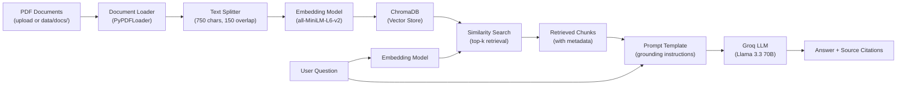

# AI Knowledge Assistant

A RAG-powered question-answering system that turns any collection of PDF documents into a searchable, conversational knowledge base — with source citations and automated evaluation.

Upload your PDFs, ask questions, get grounded answers with page-level citations. Works out of the box with a pre-loaded Python tutorial.

## Architecture



## Features

- **Works out of the box** — a sample Python tutorial is pre-loaded so you can try it immediately
- **Upload any PDFs** — drag and drop through the web UI, or place files in `data/docs/` for CLI mode
- **Session-scoped** — each browser session is independent; closing the tab clears your uploaded documents
- **Semantic search** — finds relevant passages by meaning, not just keywords
- **Grounded answers** — the LLM answers ONLY from retrieved context, reducing hallucination
- **Source citations** — every answer shows which document and page the information came from
- **RAGAS evaluation** — automated quality scoring (faithfulness, context recall, factual correctness, semantic similarity)
- **Full observability** — every query traced end-to-end in LangSmith
- **Bring your own key** — enter your free Groq API key in the sidebar; keys are never stored
- **Configurable** — chunk size, retrieval depth, model selection — all via `.env`

## Tech Stack

| Component | Technology |
|---|---|
| LLM | [Groq](https://groq.com) (Llama 3.3 70B Versatile) |
| Embeddings | [HuggingFace](https://huggingface.co) (all-MiniLM-L6-v2) |
| Vector Store | [ChromaDB](https://trychroma.com) (in-memory on cloud, persisted locally) |
| Framework | [LangChain](https://python.langchain.com) |
| Evaluation | [RAGAS](https://docs.ragas.io) |
| Observability | [LangSmith](https://smith.langchain.com) |
| UI | [Streamlit](https://streamlit.io) |

## Demo

**[Try the live app](https://ai-knowledgge-assistant.streamlit.app/)** — no installation needed. Enter your free Groq API key, upload your PDFs, and start asking questions.

### How to use the live app

1. Open the link above
2. Enter your Groq API key in the sidebar (get one free at [console.groq.com/keys](https://console.groq.com/keys))
3. A Python tutorial is pre-loaded — try the suggested questions or ask your own
4. To use your own documents: upload PDFs in the sidebar → click "Build Knowledge Base" → ask questions
5. Close the tab to end your session — uploaded documents are not stored

## Quick Start (Local)

### Prerequisites

- Python 3.11+
- A free [Groq API key](https://console.groq.com/keys) (takes 30 seconds)
- (Optional) A free [LangSmith API key](https://smith.langchain.com) for tracing

### 1. Clone the repo

```bash
git clone https://github.com/dunjeonmaster07/ai-knowledge-assistant.git
cd ai-knowledge-assistant
```

### 2. Create a virtual environment

```bash
python -m venv .venv
source .venv/bin/activate    # macOS/Linux
# .venv\Scripts\activate     # Windows
```

### 3. Install dependencies

```bash
pip install -r requirements.txt
```

### 4. Set up your API keys

```bash
cp .env.example .env
```

Open `.env` and add your Groq API key:

```
GROQ_API_KEY=gsk_your_actual_key_here
```

**How to get a Groq API key:**
1. Go to [console.groq.com](https://console.groq.com)
2. Sign up (free)
3. Go to API Keys → Create API Key
4. Copy the key into your `.env` file

### 5. Add your documents

Place your PDF files in the `data/docs/` folder. A sample PDF is included so you can test immediately.

```bash
ls data/docs/
# python-tutorial.pdf  (sample — add your own PDFs alongside or replace it)
```

### 6. Run ingestion (local only)

```bash
python -m src.ingest
```

This reads your PDFs, chunks them, generates embeddings, and stores everything in ChromaDB on disk. Run this once, or whenever you add new documents (delete `chroma_db/` first to rebuild).

> **Note:** On Streamlit Cloud, ingestion runs automatically in-memory. No manual step needed.

### 7. Start the app

**Streamlit UI (recommended):**
```bash
streamlit run app.py
```

**CLI mode:**
```bash
python main.py
```

## How It Works

### Ingestion Pipeline

1. **Load** — `PyPDFLoader` reads each PDF page by page
2. **Chunk** — `RecursiveCharacterTextSplitter` splits pages into ~750-character pieces with 150-character overlap to preserve context across chunk boundaries
3. **Embed** — `all-MiniLM-L6-v2` converts each chunk into a 384-dimensional vector representing its semantic meaning
4. **Store** — vectors are stored in ChromaDB (persisted to disk locally, in-memory on Streamlit Cloud)

### Query Pipeline

1. **Embed the question** — same embedding model converts your question into a vector
2. **Retrieve** — ChromaDB finds the top-k chunks most similar to the question vector
3. **Augment** — retrieved chunks are injected into a prompt that instructs the LLM to answer ONLY from the provided context
4. **Generate** — Groq's Llama 3.3 70B generates a grounded answer
5. **Cite** — source document names and page numbers are displayed alongside the answer

## Evaluation with RAGAS

The system includes an automated evaluation pipeline using [RAGAS](https://docs.ragas.io) to measure retrieval and generation quality with real metrics — not just "it looks right."

### Step 1: Create evaluation questions

Create `data/eval/eval_questions.json` with question-answer pairs based on your documents:

```json
[
  {
    "question": "What is a for loop in Python?",
    "ground_truth": "A for loop iterates over a sequence (list, tuple, string, etc.) and executes a block of code for each item."
  },
  {
    "question": "How do you define a function in Python?",
    "ground_truth": "Functions are defined using the def keyword, followed by the function name, parentheses with optional parameters, and a colon."
  }
]
```

> A sample template is provided at `data/eval/eval_questions_sample.json`. Write 15–20 questions for meaningful results.

### Step 2: Make sure your documents are ingested

```bash
python -m src.ingest
```

### Step 3: Run the evaluation

```bash
python -m src.evaluate
```

This runs each question through the RAG pipeline, collects the generated answers and retrieved contexts, and scores them with RAGAS.

### Step 4: Read the scorecard

```
============================================================
RAGAS EVALUATION SCORECARD
============================================================
  Faithfulness:           0.8500
  LLM Context Recall:    0.7800
  Factual Correctness:   0.8200
  Semantic Similarity:   0.9100

  Evaluation time: 45.2s
============================================================
```

Detailed per-question results are saved to `data/eval/eval_results.json`.

### What the metrics mean

| Metric | What it measures | Why it matters |
|---|---|---|
| **Faithfulness** | Is the answer supported by the retrieved context? | Catches hallucination — the LLM making things up |
| **Context Recall** | Did the retriever find the chunks needed to answer? | Catches retrieval failures — answer exists but wasn't found |
| **Factual Correctness** | Does the generated answer match the ground truth? | Catches wrong answers |
| **Semantic Similarity** | How close is the answer's meaning to the ground truth? | Softer quality measure |

## Configuration

All settings can be overridden via environment variables in `.env`:

| Variable | Default | Description |
|---|---|---|
| `GROQ_API_KEY` | (required) | Your Groq API key |
| `LLM_MODEL` | `llama-3.3-70b-versatile` | Which Groq model to use |
| `EMBEDDING_MODEL` | `all-MiniLM-L6-v2` | HuggingFace embedding model |
| `CHUNK_SIZE` | `750` | Characters per chunk |
| `CHUNK_OVERLAP` | `150` | Overlap between chunks |
| `RETRIEVER_K` | `5` | Number of chunks to retrieve |

## Project Structure

```
ai-knowledge-assistant/
├── src/
│   ├── config.py         # Centralized configuration
│   ├── ingest.py         # Document loading + chunking + embedding
│   ├── retriever.py      # Vector store retrieval
│   ├── chain.py          # RAG chain (retriever → prompt → LLM)
│   └── evaluate.py       # RAGAS evaluation pipeline
├── data/
│   ├── docs/             # Sample PDF + place your own here (local mode)
│   └── eval/             # Evaluation questions + results
├── app.py                # Streamlit web interface
├── main.py               # CLI interface
├── .env.example          # Environment variable template
├── requirements.txt      # Python dependencies
└── README.md
```

## Lessons Learned

- **Chunk size significantly affects retrieval quality.** Too large (2000+) and you retrieve irrelevant noise alongside the answer. Too small (200) and you lose context. 750 with 150 overlap was the sweet spot for technical documentation.
- **The system prompt matters more than the model.** Explicit grounding instructions ("answer ONLY from the context") dramatically reduced hallucination compared to a generic "be helpful" prompt.
- **Evaluation is non-negotiable.** Without RAGAS metrics, "it works" is subjective. With metrics, you can prove retrieval quality improved after tuning chunk size or adding overlap.
- **Cloud deployment needs different storage strategies.** ChromaDB's SQLite persistence doesn't work on Streamlit Cloud's restricted filesystem. In-memory storage with `@st.cache_resource` was the reliable solution.

## License

MIT

---

Built by [Ankit Chaudhary](https://github.com/dunjeonmaster07) as part of an AI Solutions Engineer upskilling journey.
