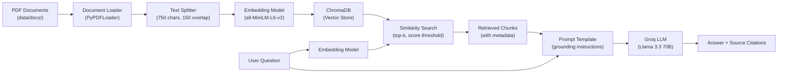

# AI Knowledge Assistant

A RAG-powered question-answering system that turns any collection of PDF documents into a searchable, conversational knowledge base — with source citations and automated evaluation.

Drop your PDFs in a folder, run the app, and ask questions. The system retrieves relevant passages, generates grounded answers, and shows you exactly where the answer came from.

## Architecture



## Features

- **Any-document ingestion** — drop PDFs into `data/docs/`, run ingestion, and start asking
- **Semantic search** — finds relevant passages by meaning, not just keywords
- **Grounded answers** — the LLM is instructed to answer ONLY from retrieved context, reducing hallucination
- **Source citations** — every answer shows which document and page the information came from
- **RAGAS evaluation** — automated quality scoring (faithfulness, context recall, factual correctness, semantic similarity)
- **Full observability** — every query traced end-to-end in LangSmith
- **Configurable** — chunk size, retrieval depth, score threshold, model selection — all via `.env`

## Tech Stack


| Component     | Technology                                               |
| ------------- | -------------------------------------------------------- |
| LLM           | [Groq](https://groq.com) (Llama 3.3 70B Versatile)       |
| Embeddings    | [HuggingFace](https://huggingface.co) (all-MiniLM-L6-v2) |
| Vector Store  | [ChromaDB](https://trychroma.com)                        |
| Framework     | [LangChain](https://python.langchain.com)                |
| Evaluation    | [RAGAS](https://docs.ragas.io)                           |
| Observability | [LangSmith](https://smith.langchain.com)                 |
| UI            | [Streamlit](https://streamlit.io)                        |


## Demo


> **Live app:** [Coming soon — deploy to Streamlit Cloud]
>
> **Video walkthrough:** [Coming soon — 3-minute YouTube demo]

App Screenshot


## Quick Start

### Prerequisites

- Python 3.11+
- A free [Groq API key](https://console.groq.com/keys) (takes 30 seconds to get)
- (Optional) A free [LangSmith API key](https://smith.langchain.com) for tracing

### 1. Clone the repo

```bash
git clone https://github.com/YOUR_USERNAME/ai-knowledge-assistant.git
cd ai-knowledge-assistant
```

### 2. Create a virtual environment

```bash
python -m venv .venv
source .venv/bin/activate    # macOS/Linux
# .venv\Scripts\activate     # Windows
```

### 3. Install dependencies

```bash
pip install -r requirements.txt
```

### 4. Set up your API keys

```bash
cp .env.example .env
```

Open `.env` and add your Groq API key:

```
GROQ_API_KEY=gsk_your_actual_key_here
```

**How to get a Groq API key:**

1. Go to [console.groq.com](https://console.groq.com)
2. Sign up (free)
3. Go to API Keys → Create API Key
4. Copy the key into your `.env` file

### 5. Add your documents

Place your PDF files in the `data/docs/` folder. A sample PDF is included so you can test immediately.

```bash
ls data/docs/
# python-tutorial.pdf  (sample — replace with your own documents)
```

### 6. Run ingestion

```bash
python -m src.ingest
```

This reads your PDFs, chunks them, generates embeddings, and stores everything in ChromaDB. You only need to run this once (or when you add new documents).

### 7. Start the app

**Streamlit UI (recommended):**

```bash
streamlit run app.py
```

**CLI mode:**

```bash
python main.py
```

## How It Works

### Ingestion Pipeline (offline, run once)

1. **Load** — `PyPDFLoader` reads each PDF page by page
2. **Chunk** — `RecursiveCharacterTextSplitter` splits pages into ~750-character pieces with 150-character overlap to preserve context across boundaries
3. **Embed** — `all-MiniLM-L6-v2` converts each chunk into a 384-dimensional vector representing its semantic meaning
4. **Store** — vectors are persisted in ChromaDB on disk for fast retrieval

### Query Pipeline (online, every question)

1. **Embed the question** — same embedding model converts your question to a vector
2. **Retrieve** — ChromaDB finds the top-k chunks most similar to the question vector (filtered by score threshold to exclude irrelevant results)
3. **Augment** — retrieved chunks are injected into a prompt template that instructs the LLM to answer ONLY from the provided context
4. **Generate** — Groq's Llama 3.3 70B generates the answer, grounded in the retrieved passages
5. **Cite** — source document names and page numbers are displayed alongside the answer

## Evaluation

The system includes an automated evaluation pipeline using [RAGAS](https://docs.ragas.io).

### Running evaluation

1. Create your evaluation questions in `data/eval/eval_questions.json`:

```json
[
  {
    "question": "What is a for loop in Python?",
    "ground_truth": "A for loop iterates over a sequence (list, tuple, string, etc.) and executes a block of code for each item."
  }
]
```

1. Run the evaluation:

```bash
python -m src.evaluate
```

1. View the scorecard:

```
============================================================
RAGAS EVALUATION SCORECARD
============================================================
  Faithfulness:           0.XXXX
  LLM Context Recall:    0.XXXX
  Factual Correctness:   0.XXXX
  Semantic Similarity:   0.XXXX
============================================================
```


### What the metrics mean


| Metric                  | What it measures                                       | Why it matters             |
| ----------------------- | ------------------------------------------------------ | -------------------------- |
| **Faithfulness**        | Is the answer supported by the retrieved context?      | Catches hallucination      |
| **Context Recall**      | Did the retriever find the chunks needed to answer?    | Catches retrieval failures |
| **Factual Correctness** | Does the answer match the ground truth?                | Catches wrong answers      |
| **Semantic Similarity** | How close is the answer's meaning to the ground truth? | Softer quality measure     |


## Configuration

All settings can be overridden via environment variables in `.env`:


| Variable          | Default                   | Description                  |
| ----------------- | ------------------------- | ---------------------------- |
| `GROQ_API_KEY`    | (required)                | Your Groq API key            |
| `LLM_MODEL`       | `llama-3.3-70b-versatile` | Which Groq model to use      |
| `EMBEDDING_MODEL` | `all-MiniLM-L6-v2`        | HuggingFace embedding model  |
| `CHUNK_SIZE`      | `750`                     | Characters per chunk         |
| `CHUNK_OVERLAP`   | `150`                     | Overlap between chunks       |
| `RETRIEVER_K`     | `5`                       | Number of chunks to retrieve |
| `SCORE_THRESHOLD` | `0.3`                     | Minimum similarity score     |


## Project Structure

```
ai-knowledge-assistant/
├── src/
│   ├── config.py         # Centralized configuration
│   ├── ingest.py         # Document loading + chunking + embedding
│   ├── retriever.py      # Vector store retrieval
│   ├── chain.py          # RAG chain (retriever → prompt → LLM)
│   └── evaluate.py       # RAGAS evaluation pipeline
├── data/
│   ├── docs/             # Place your PDF files here
│   └── eval/             # Evaluation questions + results
├── app.py                # Streamlit web interface
├── main.py               # CLI interface
├── .env.example          # Environment variable template
├── requirements.txt      # Python dependencies
└── README.md
```

## Lessons Learned


- **Chunk size significantly affects retrieval quality.** Too large (2000+) and you retrieve irrelevant noise alongside the answer. Too small (200) and you lose context. 750 with 150 overlap was the sweet spot for technical documentation.
- **The system prompt matters more than the model.** Explicit grounding instructions ("answer ONLY from the context") dramatically reduced hallucination compared to a generic "be helpful" prompt.
- **Evaluation is non-negotiable.** Without RAGAS metrics, "it works" is subjective. With metrics, you can prove retrieval quality improved after tuning chunk size or adding overlap.

## License

MIT

---

Built by [Ankit Chaudhary!](https://github.com/dunjeonmaster07)